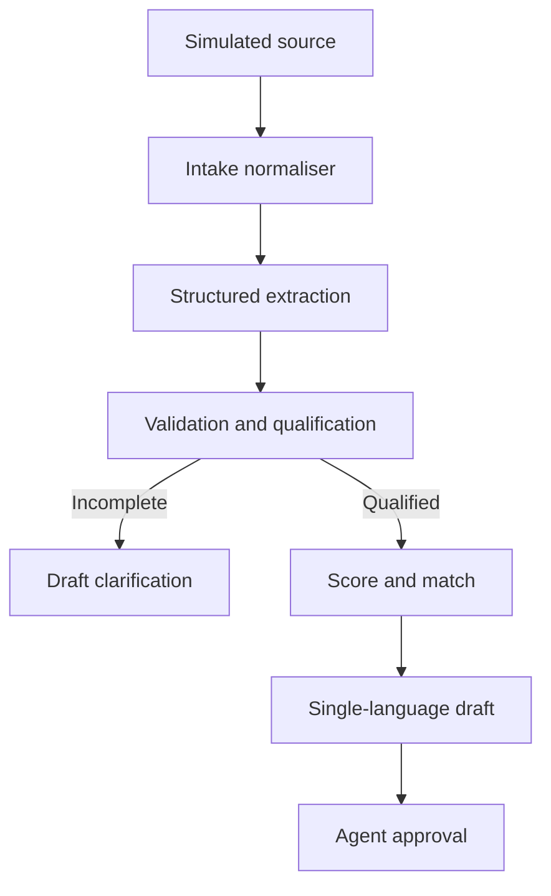

# PropLead MVP architecture

## Architecture principle

Use the LLM only where language understanding or drafting adds value. Keep scoring, property filtering, workflow status and the human approval requirement deterministic and inspectable.

## Target flow



## Component responsibilities

| Component | Responsibility | Control |
|---|---|---|
| Intake | Accept one text enquiry with source metadata | Controlled contract; no live connector required for MVP |
| Intake normaliser | Map web form, email, WhatsApp, property portal, social or manual samples to one schema | Preserve original text and channel identifiers |
| Structured extractor | Detect language and populate the lead schema | JSON schema validation; unknown values remain null |
| Validator | Identify missing fields, contradictions and risk flags | Deterministic required-field rules; incomplete cases become `needs_information` |
| Clarification assistant | Draft one concise question for missing critical information | Same-language draft; no autonomous sending; agent approval required |
| Scoring engine | Calculate readiness score and priority | Fixed documented weights; no protected attributes |
| Qualification gate | Decide whether matching can run | Matching blocked until required constraints are present and unambiguous |
| Catalogue matcher | Apply explicit hard filters and rank compatible listings | Authorised catalogue only; block unavailable or stale records |
| Reply drafter | Prepare a concise single-language response | Greeting, body and closing must use the detected language and validated facts only |
| Review queue | Present evidence and request agent action | Human approval always required |
| Evaluation layer | Record inputs, outputs, expected values and evaluator results | LangSmith planned for Round 2 experiment |

## Lead data contract

```json
{
  "lead_id": "synthetic-001",
  "source_channel": "web_form",
  "source_message_id": "msg-001",
  "received_at": "2026-09-29T18:30:00Z",
  "consent_status": "synthetic_demo",
  "source_metadata": {},
  "original_text": "...",
  "language": "en",
  "budget_eur": 800000,
  "locations": ["Palma"],
  "property_type": "apartment",
  "min_bedrooms": 2,
  "purpose": null,
  "timeline_months": 3,
  "financing_status": null,
  "must_have_features": [],
  "missing_fields": ["purpose", "financing_status"],
  "risk_flags": [],
  "confidence": "high",
  "score": 100,
  "priority": "hot",
  "qualification_status": "matching_ready",
  "matches": [
    {
      "property_id": "PM-101",
      "availability_status": "available",
      "last_verified_at": "2026-09-29",
      "match_reason": ["Palma", "apartment", "2 bedrooms", "within budget"]
    }
  ],
  "draft_reply": "...",
  "human_review_required": true,
  "status": "awaiting_agent_approval"
}
```

## Deterministic scoring proposal

| Field | Points |
|---|---:|
| Budget stated | 20 |
| Location stated | 20 |
| Property type stated | 15 |
| Bedrooms stated | 15 |
| Timeline stated | 15 |
| Purpose stated | 10 |
| Financing status stated | 5 |
| **Maximum** | **100** |

Priority bands:

- **Hot:** 80–100
- **Warm:** 55–79
- **Cold:** 0–54
- **Review:** any risk flag, prohibited request or unresolved ambiguity overrides the numeric priority

The score measures information completeness and purchase readiness signals. It does not measure a person's worth or eligibility.

## Matching rules

When explicitly stated, the following are hard filters:

1. Property status must be `available`.
2. Property availability must be within the documented verification window.
3. Price must not exceed the buyer's maximum budget.
4. Location must match an accepted target location.
5. Property type must match the requested type.
6. Bedrooms must meet or exceed the requested minimum.

Optional features can influence ranking after all hard filters pass. The matcher returns no more than three properties.

Before matching, the qualification gate requires a stated budget, a specific location and at least one of property type or minimum bedrooms. Missing optional fields remain null and do not become inferred filters.

## Failure and escalation states

- Unsupported language
- Invalid structured output
- Ambiguous budget or location
- Contradictory values or low-confidence extraction
- Missing critical information required for matching
- No compatible property
- Legal, tax, mortgage or negotiation request
- Catalogue unavailable
- Response cannot be grounded in validated data

Every failure state routes to `agent_review_required` and produces no automatic outbound message.

## Edge-case policy

The numeric score is an information-completeness aid, not a final binary decision. Any ambiguity, contradiction, low extraction confidence or prohibited request overrides Hot/Warm/Cold and assigns `priority: review`. The interface must show the triggering evidence so the agent can correct the record.

## Minimum agent interface

The MVP review screen should show, in one view:

1. Original message and source channel.
2. Extracted fields with evidence and confidence.
3. Missing information and risk flags.
4. Score explanation and qualification status.
5. Available matches with verification dates.
6. Same-language reply or clarification draft.
7. Approve, edit, reject and escalate actions.

## Current versus planned

| Capability | Current baseline | Round 2 target |
|---|---|---|
| Intake | Manual sample message | Simple controlled form or CLI input |
| Channel handling | Source implied by demo | Explicit source enum and normalised intake contract |
| Extraction | Transparent rules in n8n | Structured LLM output plus validation |
| Scoring | Deterministic | Retain deterministic logic |
| Matching | Synthetic catalogue rules | Retain and test hard filters |
| Drafting | Template-based; one observed language-switch failure | Grounded draft with whole-message language validation |
| Approval | Agent review queue | Explicit approve, edit or reject action |
| Evaluation | Five manual cases | Multilingual LangSmith dataset and experiment |

This document describes the target architecture. Only capabilities that have been executed successfully may be presented as implemented.
